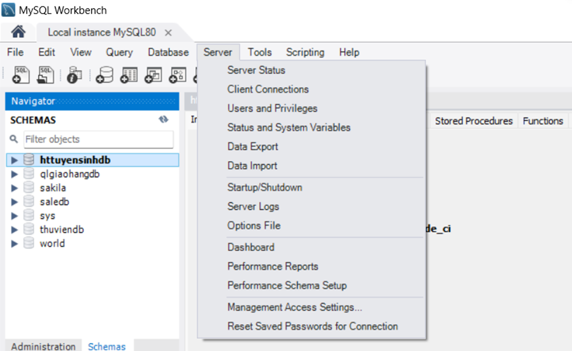
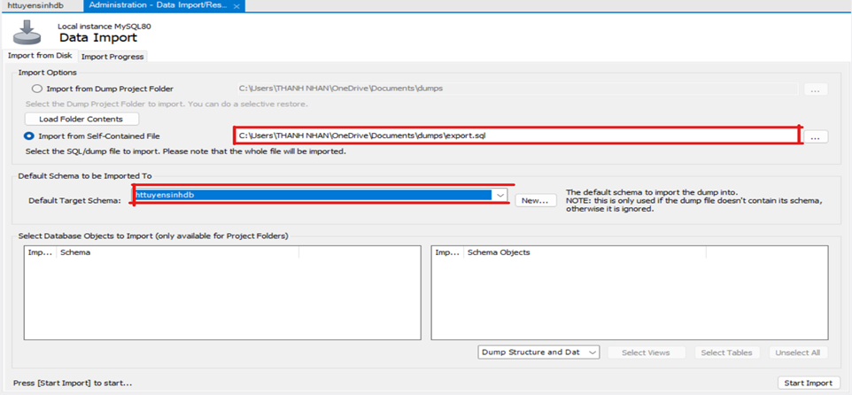

# HoTroSv
## Đầu tiên hãy import cơ sỡ dữ liệu
1. Sử dụng MySQL
2. Tạo cơ sở dữ liệu có tên httuyensinhdb
3. Click vào server 
4. Click tiếp vào Data Import Và chọn file database, cơ sở dữ liệu httuyensinh 
5. Start Import
6. Hoàn thành
## Hướng dẫn cài đặt hệ thống HoTroTS Back-end
1. Clone project về máy 

    git clone https://github.com/nguyenthanhnhan1606/HoTroTS.git
2. Sử dụng IntelliJ IDE hoặc Eclipse có cài đặt JDK để chạy máy ảo java.
3. Mở project **Wedhotrots** và build. có thể sử dụng giao diện hoặc môi trường dòng lệnh terminal như sau:

    mvn clean install

4. Trong file application.properties

- Sửa **spring.datasource.username** thành username đăng nhập mysql của máy đang sử dụng 
- Sửa **spring.datasource.password** thành password đăng nhập mysql của máy đang dùng   
5. Nhấn vào icon run trên giao diện của IntelliJ IDE ▶️ Run 
6. Hoàn tất
## Hướng dẫn cài đặt hệ thống HoTroTS Front-end
1. Sử dụng Visual Studio Code
2. Mở project **wedhotrots** (Nếu chưa clone project về thì clone về như bước 1 của back-end)
3. Mở terminal trong Visual Studio Code và gõ lệnh **npm install**
4. Gõ lệnh **npm run serve**
5. Hoàn tất